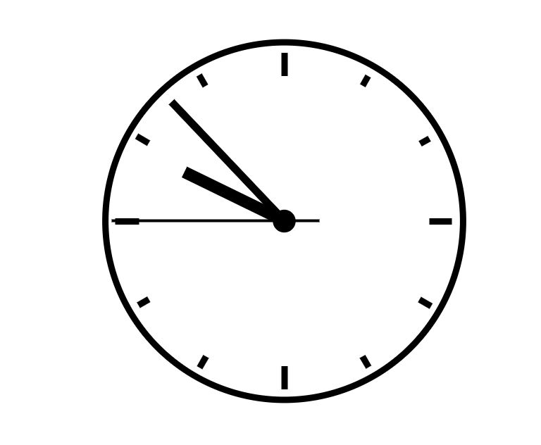

# javascript-clock  

Simple clock that runs on JavaScript.  
SVG file and CSS for clock's image obtained from [Morten Rand-Hendriksen](https://www.linkedin.com/in/mortenrandhendriksen/)'s course for Essential JavaScript Training.  
  
  
### Clock Preview

